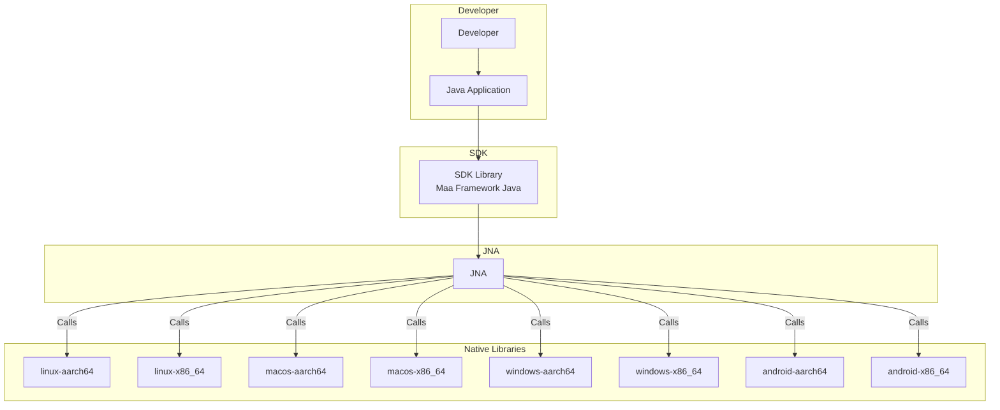

# Maa Framework Java



## 👏 项目特点

- 纯 Java 代码调用 [MaaFramework](https://github.com/MaaXYZ/MaaFramework)
- 支持 Windows、Linux、Mac 平台
- 开箱即用，开发者无需考虑如何引入和对接本地库

## 🎉 快速开始

- [示例代码](maa-sample/README.md)
- [maa-framework-java-sample](https://github.com/hanhuoer/maa-framework-java-sample) 咸鱼之王脚本
    - 咸鱼之王脚本示例：钓鱼、罐子、答题、挂机奖励等

### 1️⃣ 添加依赖

此方式会根据当前系统自动使用对应的 jar 包

```xml
<dependency>
  <groupId>io.github.hanhuoer</groupId>
  <artifactId>maa-framework-java</artifactId>
    <version>2.0.1</version>
</dependency>
```

通常情况下，只需引入 `maa-framework-java` 这个包即可满足开发需求。

如果您需要包含所有平台的本地库，可以选择引入 `maa-all` 包：

```xml
<dependency>
  <groupId>io.github.hanhuoer</groupId>
  <artifactId>maa-all</artifactId>
    <version>2.0.1</version>
</dependency>
```

如果是 spring boot 项目，则可使用以下依赖 [maa-spring-boot-starter 文档](maa-spring-boot-starter/README.md)

```xml

<dependency>
    <groupId>io.github.hanhuoer</groupId>
    <artifactId>maa-spring-boot-starter</artifactId>
    <version>2.0.1</version>
</dependency>
```

### 2️⃣ 使用示例

```java
public class Main {
    public static void main(String[] args) {
        MaaOptions options = new MaaOptions();
        Maa maa = Maa.create(options);

        List<AdbInfo> adbInfoList = AdbController.find();
        AdbController controller = new AdbController(adbInfoList.get(0));
        controller.connect();
        Resource resource = new Resource();
        resource.load("./resource");
        Tasker tasker = new Tasker();
        boolean bind = tasker.bind(controller, resource);
        System.out.println("bind result: " + bind);
        System.out.println(tasker.inited());
        tasker.close();
    }
}
```

>
更多使用示例请参考 [使用示例](maa-sample)

## 💻 开发指南

### 1️⃣ 拉取仓库代码

```
git clone https://github.com/hanhuoer/maa-framework-java.git
```

### 2️⃣ 添加本地库文件

#### MaaAgentBinary

- 请参考 [agent - README.md](maa-agent/src/main/resources/README.md) 文档

#### MaaFramework Native Libraries

**方式一：手动放置本地库文件**

将各平台的本地库文件手动放到对应目录中

- [linux-aarch64 - README.md](maa-linux-aarch64/src/main/resources/README.md)
- [linux-x86_64 - README.md](maa-linux-x86_64/src/main/resources/README.md)
- [macos-aarch64 - README.md](maa-macos-aarch64/src/main/resources/README.md)
- [macos-x86_64 - README.md](maa-macos-x86_64/src/main/resources/README.md)
- [windows-aarch64 - README.md](maa-windows-aarch64/src/main/resources/README.md)
- [windows-x86_64 - README.md](maa-windows-x86_64/src/main/resources/README.md)
- [android-aarch64 - README.md](maa-android-aarch64/src/main/resources/README.md)
- [android-x86_64 - README.md](maa-android-x86_64/src/main/resources/README.md)

**方式二：通过脚本自动放置文件 【推荐】**

1. 下载所有平台的发布包放到目录 [maa-libs](maa-libs) 中
   ```
   └─maa-libs
     │ MAA-linux-aarch64-version.zip
     │ MAA-linux-x86_64-version.zip
     │ MAA-macos-aarch64-version.zip
     │ MAA-macos-x86_64-version.zip
     │ MAA-win-aarch64-version.zip
     │ MAA-win-x86_64-version.zip
     │ MAA-android-aarch64-version.zip
     │ MAA-android-x86_64-version.zip
   ```
2. 执行脚本 `python scripts/copy_lib.py`
   > 该脚本会清理目标文件夹，并将解压后的本地库复制过去

### 3️⃣ 安装

```
mvn clean install -Dmaven.test.skip
```

## 相关项目

- [MaaFramework](https://github.com/MaaXYZ/MaaFramework)
- [MaaAgentBinary](https://github.com/MaaXYZ/MaaAgentBinary)
- [maa-node](https://github.com/neko-para/maa-node)
- [maa-framework-go](https://github.com/MaaXYZ/maa-framework-go)
- [maa-framework-rs](https://github.com/MaaXYZ/maa-framework-rs)
