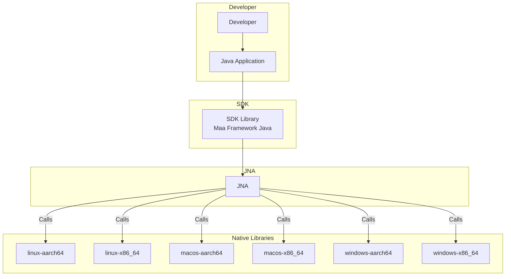

# Maa Framework Java



## 👏 项目特点

- 纯 Java 代码调用 [MaaFramework](https://github.com/MaaXYZ/MaaFramework)
- 支持 Windows、Linux、Mac 平台
- 开箱即用，开发者无需考虑如何引入和对接本地库

## 🎉 快速开始

[示例代码](maa-sample/README.md)

### 1️⃣ 添加依赖

此方式会根据当前系统自动使用对应的 jar 包

```xml
<dependency>
  <groupId>io.github.hanhuoer</groupId>
  <artifactId>maa-framework-java</artifactId>
  <version>1.0.0</version>
</dependency>
```

通常情况下，只需引入 `maa-framework-java` 这个包即可满足开发需求。

如果您需要包含所有平台的本地库，可以选择引入 `maa-all` 包：

```xml
<dependency>
  <groupId>io.github.hanhuoer</groupId>
  <artifactId>maa-all</artifactId>
  <version>1.0.0</version>
</dependency>
```

### 2️⃣ 使用示例

```java
public class Main {
    public static void main(String[] args) {
        MaaOptions options = new MaaOptions();
        Maa maa = Maa.create(options);

        List<AdbInfo> adbInfoList = AdbController.find();
        AdbController controller = new AdbController(adbInfoList.get(0));
        controller.connect();
        Resource resource = new Resource();
        resource.load("./resource");
        Instance instance = new Instance();
        boolean bind = instance.bind(controller, resource);
        System.out.println("bind result: " + bind);
        System.out.println(instance.inited());
    }
}
```

>
更多使用示例请参考 [使用示例](maa-sample)


## 💻 开发指南

### 1️⃣ 拉取仓库代码

```
git clone https://github.com/hanhuoer/maa-framework-java.git
```

### 2️⃣ 跟着以下文档，填充各环境的本地库文件

- [agent - README.md](maa-agent/src/main/resources/README.md)
- [linux-aarch64 - README.md](maa-linux-aarch64/src/main/resources/README.md)
- [linux-x86_64 - README.md](maa-linux-x86_64/src/main/resources/README.md)
- [macos-aarch64 - README.md](maa-macos-aarch64/src/main/resources/README.md)
- [macos-x86_64 - README.md](maa-macos-x86_64/src/main/resources/README.md)
- [windows-aarch64 - README.md](maa-windows-aarch64/src/main/resources/README.md)
- [windows-x86_64 - README.md](maa-windows-x86_64/src/main/resources/README.md)

### 3️⃣ 安装

```
mvn clean install -Dmaven.test.skip
```

## 相关项目

- [MaaFramework](https://github.com/MaaXYZ/MaaFramework)
- [MaaAgentBinary](https://github.com/MaaXYZ/MaaAgentBinary)
- [maa-node](https://github.com/neko-para/maa-node)
- [maa-framework-go](https://github.com/MaaXYZ/maa-framework-go)
- [maa-framework-rs](https://github.com/MaaXYZ/maa-framework-rs)
